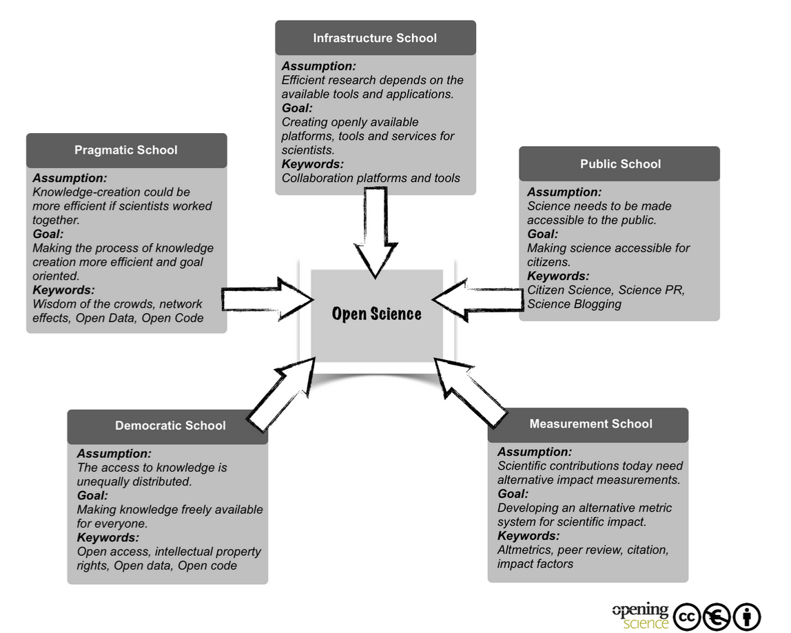

# What is Citizen Science?
Citizen Science is an umbrella term for activities that bring the general public into the process of scientific inquiry. It is often used to refer to data collection, organization, or analysis activities where the primary contributors are not professionally trained or actively practicing scientists.

The philosophy behind Citizen Science is rooted in a few core ideas:
* access to knowledge is unequally distributed and both knowledge creation and dissemination is restricted to those with resources;
* both the production of research and dissemination of research should be made accessible to the public generally;
* publicly funded research in particular belongs to citizens;
* pragmatically, it is impossible for scientists to ask some questions or collect some kinds of data with the financial, physical, and time resources that they have without the help of crowdsourcing or shared computational infrastructure.

To see how these ideas and more fit into Open Science more generally, take a look at "[Open Science: One Term, Five Schools or Thought](http://book.openingscience.org.s3-website-eu-west-1.amazonaws.com/basics_background/open_science_one_term_five_schools_of_thought.html)" by Benedikt Fecher & Sascha Friesike.

Learn more about Citizen Science from this [National Geographic learning resource](https://www.nationalgeographic.org/encyclopedia/citizen-science/) and explore [other Nat Geo resources on the topic of Citizen Science](https://www.nationalgeographic.org/topics/citizen-science/?q=&page=1&per_page=25).
{: .note}

## Is the "Citizen Scientist" a new idea?
No! Before the 1800s. scientists were often not professionally trained and data collection belonged to interested citizens. Many of the conventions of modern scientific discourse are rooted in these early debates between "armchair philosophers" who took a part time interest in scientific endeavours and the world around them.

In fact the term "scientist" comes from the Cambridge University historian and philosopher of science [William Whewell](https://plato.stanford.edu/entries/whewell/) who coined it in response a challenge from the English poet Samuel Taylor Coleridge and out of a need for a term to describe the rising scientific professions. Scientist was inspired by the use of "artist" for professionals who create art.

Learn more about [how the word Scientist came to be](https://www.npr.org/templates/story/story.php?storyId=127037417). For more on the history of science as a profession watch [Laura Snyder's Ted Talk](https://www.ted.com/talks/laura_snyder_the_philosophical_breakfast_club?language=en) or explore her book [The Philosophical Breakfast Club](https://vpl.bibliocommons.com/item/show/2383885038).
{: .note}

## Impact and social good
Citizen Scientists contribute heavily to their communities and the research going on around them. There are many examples of Citizen Scientists contributing to real change for good.

A particularly famous example is the Flint Water Crisis in 2016 in which a Citizen Science project uncovered a community-wide outbreak of Legionella which is a harmful bacterium stemming from the city's water source.

Citizen science is happening in many places; in video games, at UBC and worldwide.

Learn more about[Citizen Science and the Flint Water Crisis](https://theoryandpractice.citizenscienceassociation.org/articles/10.5334/cstp.154/). An example of citizen science in a video game is the Borderlands Science game: [Borderlands 3 bridges the gap between citizen science and blockbuster games](https://techcrunch.com/2020/04/07/borderlands-3-science-research-gut-microbiome/)
{: .note}

## Ethical considerations
While a wonderful tool for the advancement of science, Citizen Science can also raise challenging ethical questions such as:
* who owns the data collected
* how should participant privacy be protected
* is it ethical for researchers to use public funds to work through potentially low-quality data

Many of these concerns are currently being discussed in the Citizen Science community and some have suggested a framework approach for addressing them including:
* the development of clear guidelines for citizen scientists
* structured education and training for participants in projects
* and clear descriptions of intent for the sharing and use of data collected
