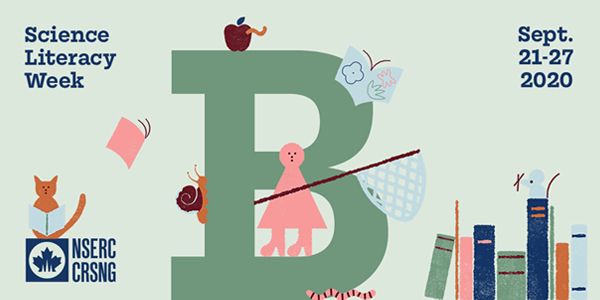

# Getting started with Citizen Science: a survey of tools and projects.

This workshop will introduce Citizen Science as a concept, common digital and analogue tools for engaging with it, and projects to be aware of and get involved with.

It part of Science Literacy Week 2020 programming and is co-presented by the <a href="https://researchcommons.library.ubc.ca/">UBC Library Research Commons</a>.

For more information on [upcoming workshops](https://researchcommons.library.ubc.ca/events/) and to view [our open workshop content](https://researchcommons.library.ubc.ca/oer/) find us at <a href="
https://researchcommons.library.ubc.ca">https://researchcommons.library.ubc.ca</a>.

## Goal of this workshop

At the end of this workshop, you will be able to:
1. Articulate what Citizen Science is.
2. Identify a few common citizen science tools and project.
3. Identify ways to get involved.

## Schedule

| 0:00 | Welcome and using Zoom|
| 0:05 | Introduction |  
| 0:10 | What is Citizen Science |
| 0:20 | Citizen Science tools and projects |   
| 1:00 | Activities |
| 1:25 | Wrap-up and Discussion |   
